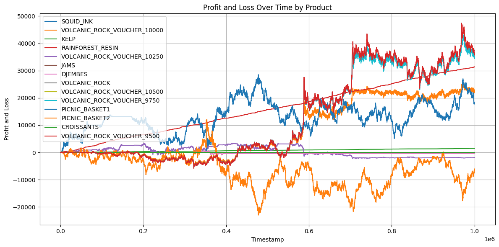

# Dragonera: IMC Prosperity 3 Trading Competition

- **Andrey Aksyutkin**  
  - GitHub: https://github.com/andandaks  
  - LinkedIn: https://www.linkedin.com/in/andrey-aksyutkin/

- **Filippo DiFazio**  
  - GitHub: https://github.com/FDF27  
  - LinkedIn: https://www.linkedin.com/in/filippo-di-fazio-12b851164/

- **Maxime Solere**  
  - GitHub: https://github.com/solerem  
  - LinkedIn: https://www.linkedin.com/in/maxime-solere/

- **Petr Skovorodnikov**  
  - GitHub: https://github.com/Skovorp  
  - LinkedIn: https://www.linkedin.com/in/petr-skovorodnikov-97862b1a7/

- **Miguel Fernandez Darder**  
  - GitHub: https://github.com/tryt0c0de  
  - LinkedIn: https://www.linkedin.com/in/miquelfd/  

## Overview

**Dragonera** is our solution to the IMC Prosperity 3 (2025) global algorithmic trading competition. Over five rounds and fifteen days, teams built trading bots to maximize profits across a variety of simulated products—everything from basic market making to ETF‑style arbitrage, options scalping, and locational arbitrage. Dragonera includes:

- End‑to‑end Jupyter notebooks and Python scripts for each round’s algorithmic challenge  
- Manual Trade Analysis

## Repository Structure
├── ToolsIMC/ # Backtesting & data‑loading utilities
├── Tutorial/ # Official IMC tutorial & starter notebooks
├── Round1/ … Round5/ # Algorithmic challenge code & notebooks
├── Pippo/ # Experimental scripts & playground
├── Trash/ # Deprecated experiments
├── .gitignore
├── README.md # ← you are here
└── output.png # Final PnL Structure for each product
::contentReference[oaicite:0]{index=0}